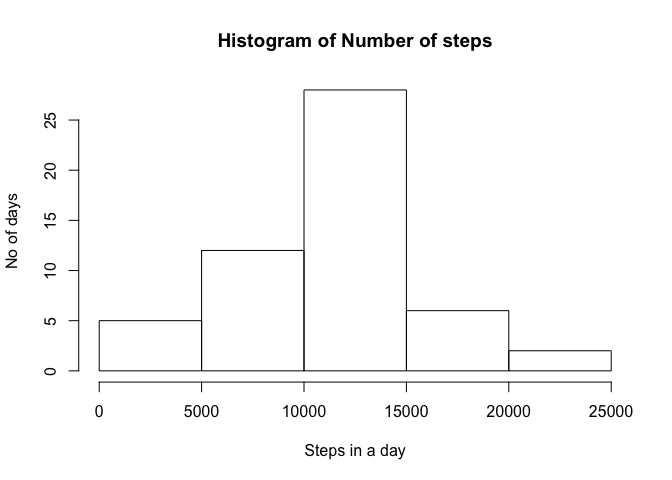
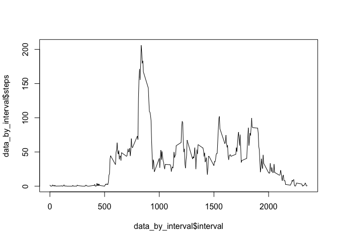
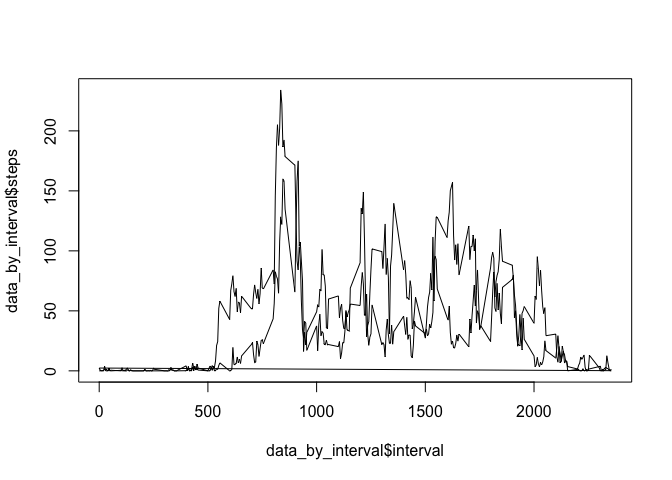

# Reproducible Research: Peer Assessment 1


## Loading and preprocessing the data

```r
raw_data <- read.csv("activity.csv")
procesed_data <-  aggregate(steps ~ date, data = raw_data, sum)
data_by_interval <-  aggregate(steps ~ interval, data = raw_data, mean)
```


## What is mean total number of steps taken per day?
* Histogram of Steps Taken per day

```r
hist(procesed_data$steps, xlab = "Steps in a day", ylab = "No of days", main = "Histogram of Number of steps")
```

<!-- -->

* Average steps per day

```r
mean(procesed_data$steps)
```

```
## [1] 10766.19
```

* Median steps per day

```r
median(procesed_data$steps)
```

```
## [1] 10765
```

## What is the average daily activity pattern?
* Average daily activity pattern

```r
plot(data_by_interval$interval,data_by_interval$steps,type = "l")
```

<!-- -->

* Interval with maximum steps on average and corresponding number of steps

```r
data_by_interval[which.max(data_by_interval$steps),]
```

```
##     interval    steps
## 104      835 206.1698
```


## Imputing missing values
* Total missing value of steps

```r
sum(is.na(raw_data$steps))
```

```
## [1] 2304
```


```r
na_locations <- which(is.na(raw_data))
new_dataset <- raw_data
for (variable in na_locations) {
    new_dataset[variable,1] <- data_by_interval[variable,2]
}
new_procesed_data <-  aggregate(steps ~ date, data = new_dataset, sum)
hist(new_procesed_data$steps, xlab = "Steps in a day", ylab = "No of days", main = "Histogram of Number of steps")
```

<!-- -->
* Average steps per day

```r
mean(new_procesed_data$steps)
```

```
## [1] 10766.19
```

* Median steps per day

```r
median(new_procesed_data$steps)
```

```
## [1] 10765.59
```

Mean and median have not changed significantly, perhaps rounding the number of steps would give better results

## Are there differences in activity patterns between weekdays and weekends?


```r
library(timeDate)
iwd <- isWeekday(new_dataset$date, wday=1:5)
new_dataset <- cbind(raw_data, iwd)
head (new_dataset)
```

```
##   steps       date interval  iwd
## 1    NA 2012-10-01        0 TRUE
## 2    NA 2012-10-01        5 TRUE
## 3    NA 2012-10-01       10 TRUE
## 4    NA 2012-10-01       15 TRUE
## 5    NA 2012-10-01       20 TRUE
## 6    NA 2012-10-01       25 TRUE
```

```r
data_by_interval <-  aggregate(steps ~ interval + iwd, data = new_dataset, mean)
head(data_by_interval)
```

```
##   interval   iwd    steps
## 1        0 FALSE 0.000000
## 2        5 FALSE 0.000000
## 3       10 FALSE 0.000000
## 4       15 FALSE 0.000000
## 5       20 FALSE 0.000000
## 6       25 FALSE 3.714286
```

```r
#split_data <- split(data_by_interval, data_by_interval$iwd)
#str(split_data)
plot(data_by_interval$interval,data_by_interval$steps,type = "l")
```

<!-- -->
User is more active in mornings on weekdays than weekends, number of steps is also less on weekends compared to weekdays 
